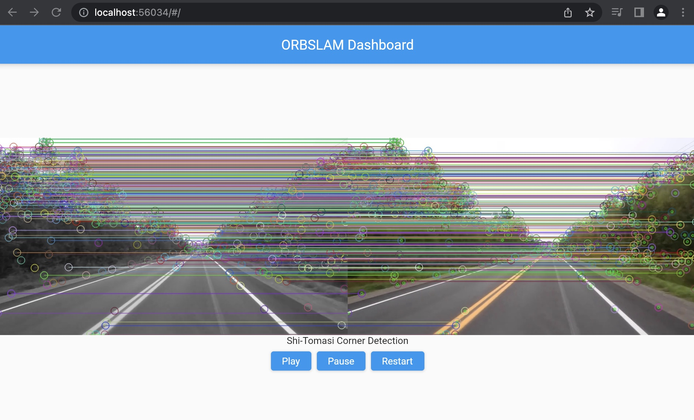

# ORBSLAM Flutter App ...🎣 for hiring managers


## What is this?

I wanted to learn about ORBSLAM and take the opportunity to demonstrate some things I have become familiar with such as openCV (python and c++ with cmake), websockets/asyncio, and flutter. 

As I make progress with my python code to run orbslam on the sample videos, I will continue to add features to the app to demonstrate the results.
I have also building out the same backend in c++ with vscode debugging and cmake to get a deep understanding of the data structures.

So far, you can view the results of feature matching across consecutive frames with controls to pause, play and restart the video. 
Later I want to build and visualize a map of the environment (and the camera's position in it) as the video plays.

<br/><br/>





### TODO 
- [x] Verify the websockets image stream is the way to go
- [x] Connect the slam script to the python server
- [x] Give the flutter app a basic UI
- [x] Setup the app to receive the slam data and image feed
- [x] Build an equivalent c++ version of the slam script so far
- [x] Setup vscode c++ code debugging 
- [x] Hook up commands from the UI back to the server
- [ ] Make the app look fancier
- [ ] Continue to build out the slam script and improve the UI

## Setup 

### Image Processing 

Activate virtual environment

```bash
source env/bin/activate
```

Install python dependencies (produced by `pip freeze > requirements.txt`)
    
```bash
pip3 install -r requirements.txt
```

### Flutter app 

Follow the flutter setup instructions [here](https://docs.flutter.dev/get-started/install)


## How to run

Launch the image processing script and websocket server

```bash
python3 slam.py
```

then launch the flutter app

```bash
flutter run -d chrome
```


